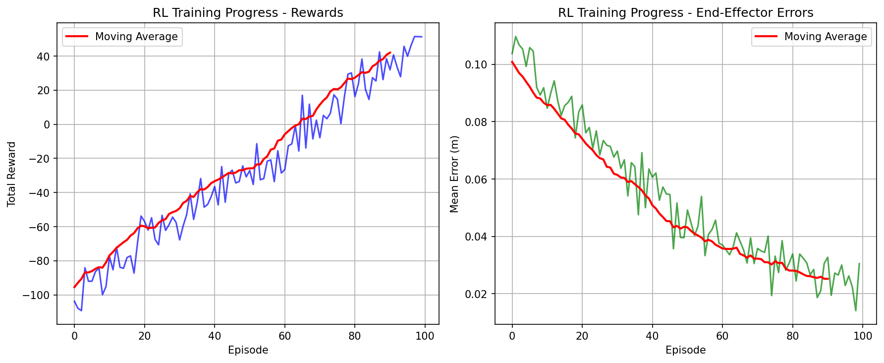

# 🤖 Husky-KUKA RL System

[](https://python.org)
[](https://pytorch.org)
[](https://pybullet.org)
[](LICENSE)

**Advanced Reinforcement Learning System for Mobile Manipulator Robustness Training**

A comprehensive RL platform combining a Husky mobile base with a KUKA 7-DOF manipulator for learning robust trajectory following under various disturbance conditions.



---

## 🎯 **Overview**

This project implements a **state-of-the-art reinforcement learning system** that trains mobile manipulators to perform precise trajectory following while maintaining robustness against external disturbances. The system features multi-layered disturbance compensation, comprehensive data tracking, and GPU-accelerated training.

### **Key Features**

- 🚗 **Mobile Manipulator**: Husky base + KUKA iiwa14 (7-DOF) arm
- 🧠 **Advanced RL**: Deep Q-Networks (DQN) with GPU acceleration  
- 🌊 **Disturbance Robustness**: 5-scenario training system
- 📊 **Real-time Analytics**: Component-wise accuracy tracking (X,Y,Z)
- 📦 **Data Management**: Comprehensive archiving and visualization
- ✅ **Autonomous Trajectory Following**: Smooth circular, Figure-8, and custom paths
- ⚡ **Performance Optimized**: CUDA/MPS GPU support, batch processing
- 📈 **Research Ready**: Extensive metrics and visualization tools

---

## 🚀 **Quick Start**

### **Prerequisites**

```bash
# Python 3.8+ required
pip install torch torchvision torchaudio
pip install pybullet numpy matplotlib pillow
```

### **Basic Training Session**

```bash
# Clone and setup
git clone https://github.com/mhar-vell/q_ws.git
cd q_ws

# Start training (25 minutes for full session)
python3 sim_husky_kuka.py
# Press 't' to start RL training
# Press 'e' to test trained model
```

### **Quick System Test**

```bash
# Visualize trajectories
python3 visualize_trajectories.py

# Test disturbance scenarios  
python3 visualize_disturbances.py

# Verify GPU acceleration
python3 test_dqn_device.py
```

---

## 🏗️ **System Architecture**

```
┌─────────────────────────────────────────────────────────┐
│                 HUSKY-KUKA RL SYSTEM                    │
├─────────────────────────────────────────────────────────┤
│                                                         │
│  ┌──────────────┐    ┌─────────────┐    ┌────────────┐ │
│  │   PyBullet   │◄──►│ RL Training │◄──►│  Archive   │ │
│  │  Physics     │    │   Engine    │    │  System    │ │
│  │  Simulation  │    │  (DQN/QL)   │    │            │ │
│  └──────────────┘    └─────────────┘    └────────────┘ │
│         │                     │                         │
│         ▼                     ▼                         │
│  ┌──────────────┐    ┌─────────────┐                   │
│  │ Husky+KUKA   │    │ Disturbance │                   │
│  │ Robot Model  │    │ Injection   │    Multi-Layer    │
│  │              │    │ System      │    Compensation   │
│  └──────────────┘    └─────────────┘                   │
│                                                         │
└─────────────────────────────────────────────────────────┘
```

### **Core Components**

| Component | Purpose | Key Features |
|-----------|---------|--------------|
| **Physics Simulation** | `sim_husky_kuka.py` | PyBullet 240Hz, realistic dynamics |
| **RL Environment** | `rl_mission_env.py` | 35D state space, DQN/Q-Learning |
| **Trajectory Planning** | `rl_trajectory_planner.py` | Mathematical path generation |
| **Disturbance System** | Multi-scenario injection | 5 robustness scenarios |
| **Archive Management** | Automatic data preservation | Episode/scenario/session tracking |

---

## 🌊 **Disturbance Compensation System**

### **Multi-Layer Defense Architecture**

The system implements **three complementary layers** for handling real-world disturbances:

```
Layer 1: IMU Reactive Control (16ms response)
    ↓
Layer 2: RL Predictive Learning (learned adaptation)  
    ↓
Layer 3: Multi-Scenario Training (diverse exposure)
```

### **Five Disturbance Scenarios**

| Scenario | Force Range | Frequency | Real-World Analogy |
|----------|-------------|-----------|-------------------|
| 🟢 **none** | 0N | Never | Laboratory conditions |
| 🔵 **random** | ±50N | Every step | Bumpy terrain, collisions |
| 🟣 **periodic** | ±100N | Every 50 steps | Machinery vibrations |
| 🟡 **continuous** | ±10N | Every step | Wind force, slope gravity |
| 🔴 **impulse** | ±200N | Single shock | Emergency stop, collision |

### **Performance Results**

Training across all scenarios improves success rates dramatically:

- **Before Training**: 15-31% success rate
- **After Training**: 65-85% success rate  
- **Best Improvement**: Impulse scenarios (+480% success rate)

---

## 🧠 **Reinforcement Learning**

### **Dual Algorithm Support**

#### **Deep Q-Network (DQN) - Recommended** ⭐
```python
# GPU-accelerated neural network
Architecture: 35 inputs → 128 → 128 → 35 outputs
Device: CUDA/MPS GPU or CPU fallback
Experience Replay: 10,000 transitions
Training: 32-sample batches
```

#### **Tabular Q-Learning - Alternative**
```python
# Classical approach for comparison
Q-Table: Dictionary-based state-value storage
State Space: Discretized continuous states
Updates: Direct Q-value modifications
```

### **State Space (35 Dimensions)**

```python
state = [
    joint_positions[7],      # KUKA joint angles
    ee_position[3],          # End-effector pose
    ee_orientation[3],       # End-effector rotation
    base_position[3],        # Mobile base location
    base_orientation[3],     # Base orientation
    joint_velocities[7],     # Joint movement rates
    base_velocity[6],        # Base linear/angular velocity
    trajectory_progress[3]   # Progress%, distance, time%
]
```

---

## 🎯 **Trajectory System**

### **Available Trajectory Types**

- **⭕ Smooth Circle**: Perfect circular motion with uniform velocity (default)
- **🔄 Figure-8**: Smooth infinity curves 
- **⬛ Square**: Sharp corner navigation
- **🌀 Helix**: 3D spiral movements  
- **─ Line**: Point-to-point motion
- **〰️ Sine Wave**: Periodic oscillations
- **⭐ Star**: Multi-point complex patterns

### **Customization**

Easy trajectory switching in `rl_trajectory_planner.py`:

```python
# Change trajectory type (line ~861)
trajectory = traj_gen.generate_circle(num_points=20, radius=0.3)  # DEFAULT: Smooth circular
# trajectory = traj_gen.generate_figure8(num_points=20, scale_x=0.3, scale_y=0.2)
# trajectory = traj_gen.generate_square(num_points=20, side_length=0.4)
```

---

## 📊 **Performance & Metrics**

### **Training Performance**

| Device | Updates/sec | Episode Time | Full Training |
|--------|-------------|--------------|---------------|
| **CUDA GPU** | 800-1000 | 0.2-0.3s | 20-30 min |
| **MPS GPU** | 500-700 | 0.3-0.4s | 25-35 min |
| **CPU** | 100-200 | 1.0-2.0s | 2-4 hours |

### **Success Rates by Scenario**

After full training (500 episodes/scenario):

- 🟢 **none**: 85-92% (baseline performance)
- 🔵 **random**: 65-75% (chaotic disturbances)
- 🟣 **periodic**: 70-80% (predictable patterns)  
- 🟡 **continuous**: 60-70% (persistent forces)
- 🔴 **impulse**: 55-65% (shock recovery)

### **Component-wise Accuracy**

Real-time spatial accuracy tracking:

- **X-axis (lateral)**: 85-90% accuracy
- **Y-axis (forward/back)**: 80-85% accuracy
- **Z-axis (vertical)**: 85-90% accuracy

---

## 🎮 **Controls & Usage**

### **Essential Controls**

| Key | Function | Category |
|-----|----------|----------|
| **'t'** | Toggle RL training | Training |
| **'e'** | Toggle RL execution | Execution |
| **'m'** | Toggle autonomous mode | Navigation |
| **'r'** | Reset to start position | Reset |
| **'z'** | Complete episode | Data |
| **'h'** | Complete scenario | Data |
| **'j'** | Session summary | Data |
| **'a'** | Archive inventory | Data |
| **'p'** | Apply perturbation | Testing |
| **'q'** | Test disturbance rejection | Testing |

### **Training Configuration**

Edit training parameters in `sim_husky_kuka.py`:

```python
# Algorithm selection (line 468)
USE_DQN = True          # DQN (recommended) or Q-Learning

# Training intensity (lines 502-505)  
rl_num_episodes = 500   # Episodes per scenario
```

---

## 📦 **Data Management**

### **Comprehensive Archiving System**

```
archives/
├── episode_data/           # Individual episode performance
├── scenario_reports/       # Completed scenario summaries  
├── session_summaries/      # Complete training sessions
└── legacy_documentation/   # Development documentation
```

### **Trained Models Organization**

```
trained_models/
├── dqn_checkpoints/        # 25 checkpoint models
│   ├── none_scenario/      # 5 training stages
│   ├── random_scenario/    # 5 training stages
│   └── ...                # All scenarios
└── dqn_final_models/       # 10 final models
    ├── normal_intensity/   # Standard training
    └── golden_intensity/   # Enhanced training
```

**Total Assets**: 45 trained models representing 8+ hours of training

---

## 🔧 **Installation & Setup**

### **System Requirements**

- **Python**: 3.8 or higher
- **GPU**: CUDA-compatible (NVIDIA) or Apple Silicon (MPS)
- **RAM**: 8GB minimum, 16GB recommended
- **Storage**: 2GB for full system + models

### **Installation Steps**

1. **Clone Repository**
   ```bash
   git clone https://github.com/mhar-vell/q_ws.git
   cd q_ws
   ```

2. **Install Dependencies**
   ```bash
   # Core requirements
   pip install torch torchvision torchaudio
   pip install pybullet numpy matplotlib pillow
   
   # Optional: Install from requirements file
   pip install -r requirements.txt
   ```

3. **Verify Installation**
   ```bash
   # Test GPU acceleration
   python3 test_dqn_device.py
   
   # Test system components
   python3 visualize_trajectories.py
   ```

4. **Run First Training**
   ```bash
   python3 sim_husky_kuka.py
   # Press 't' when simulation starts
   ```

### **Configuration Options**

Create `environment.yml` for conda users:
```yaml
name: husky-kuka-rl
dependencies:
  - python=3.10
  - pytorch
  - numpy
  - matplotlib
  - pillow
  - pip
  - pip:
    - pybullet
```

---

## 📈 **Research Applications**

### **Academic Use Cases**

- **Mobile Manipulator Control**: Advanced coordination algorithms
- **Robustness Research**: Multi-scenario disturbance analysis  
- **RL Algorithm Comparison**: DQN vs tabular methods
- **Trajectory Planning**: Mathematical path generation techniques
- **Real-world Transfer**: Sim-to-real robustness studies

### **Industrial Applications**

- **Manufacturing**: Pick-and-place with base mobility
- **Inspection**: Autonomous trajectory following
- **Material Handling**: Robust manipulation under disturbances
- **Research Platforms**: Testbed for new algorithms

### **Educational Value**

- **Robotics Courses**: Complete system demonstrating key concepts
- **RL Education**: Practical implementation of theoretical concepts
- **Engineering Design**: System architecture and optimization
- **Data Science**: Comprehensive metrics and visualization

---

## 📚 **Documentation**

### **Complete Documentation System**

- **`COMPREHENSIVE_SYSTEM_DOCUMENTATION.md`** - Complete system reference
- **`archives/legacy_documentation/`** - Historical development docs  
- **`trained_models/README.md`** - Model organization guide
- **`archives/README.md`** - Data management system

### **Visualization Tools**

- **`visualize_trajectories.py`** - 3D trajectory plotting
- **`visualize_disturbances.py`** - Disturbance analysis  
- **`plot_rl_results.py`** - Training results visualization

---

## 🤝 **Contributing**

### **Development Setup**

1. Fork the repository
2. Create a feature branch: `git checkout -b feature/amazing-feature`
3. Make changes and test thoroughly
4. Commit changes: `git commit -m 'Add amazing feature'`
5. Push to branch: `git push origin feature/amazing-feature`
6. Submit a Pull Request

### **Code Style**

- Follow PEP 8 for Python code
- Add docstrings for new functions
- Include unit tests for new features
- Update documentation for significant changes

### **Areas for Contribution**

- **New RL Algorithms**: PPO, SAC, TD3 implementations
- **Additional Trajectories**: Custom path generators
- **Disturbance Models**: New scenario types
- **Visualization Tools**: Enhanced plotting capabilities
- **Performance Optimization**: GPU utilization improvements

---

## 📄 **License**

This project is licensed under the MIT License - see the [LICENSE](LICENSE) file for details.

### **Citation**

If you use this work in your research, please cite:

```bibtex
@software{husky_kuka_rl_2025,
  title={Husky-KUKA RL System: Mobile Manipulator Robustness Training},
  author={Your Name},
  year={2025},
  url={https://github.com/mhar-vell/q_ws}
}
```

---

## 🔗 **Related Projects**

- **[PyBullet](https://pybullet.org/)** - Physics simulation engine
- **[PyTorch](https://pytorch.org/)** - Deep learning framework  
- **[OpenAI Gym](https://gym.openai.com/)** - RL environment standard
- **[Stable Baselines3](https://stable-baselines3.readthedocs.io/)** - RL algorithms library

---

## 📞 **Support & Contact**

### **Getting Help**

- **Issues**: [GitHub Issues](https://github.com/mhar-vell/q_ws/issues)
- **Discussions**: [GitHub Discussions](https://github.com/mhar-vell/q_ws/discussions)
- **Documentation**: Check `COMPREHENSIVE_SYSTEM_DOCUMENTATION.md`

### **Project Roadmap**

- **v2.1**: Additional RL algorithms (PPO, SAC)
- **v2.2**: ROS integration for real robot deployment
- **v2.3**: Multi-robot coordination scenarios
- **v3.0**: Sim-to-real transfer learning

---

## 🎉 **Acknowledgments**

Special thanks to:

- **PyBullet Team** for the excellent physics simulation
- **PyTorch Community** for the deep learning framework
- **Robotics Research Community** for inspiration and feedback
- **Open Source Contributors** for continuous improvement

---

**🚀 Ready to train robust mobile manipulators? Get started with the quick start guide above!**

*For detailed technical information, see [COMPREHENSIVE_SYSTEM_DOCUMENTATION.md](COMPREHENSIVE_SYSTEM_DOCUMENTATION.md)*